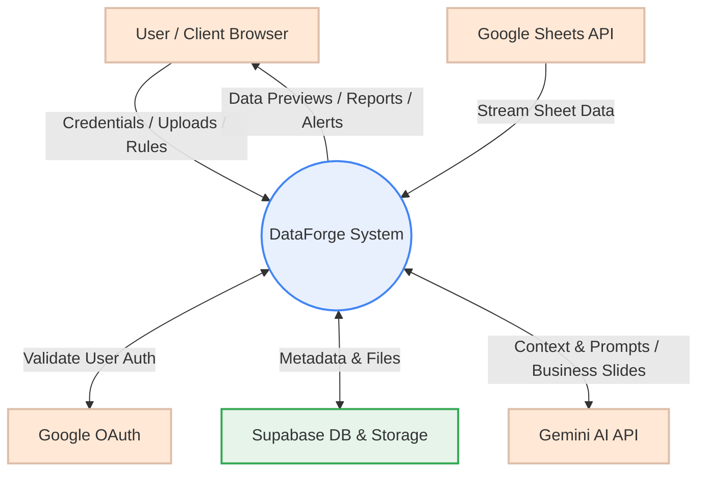
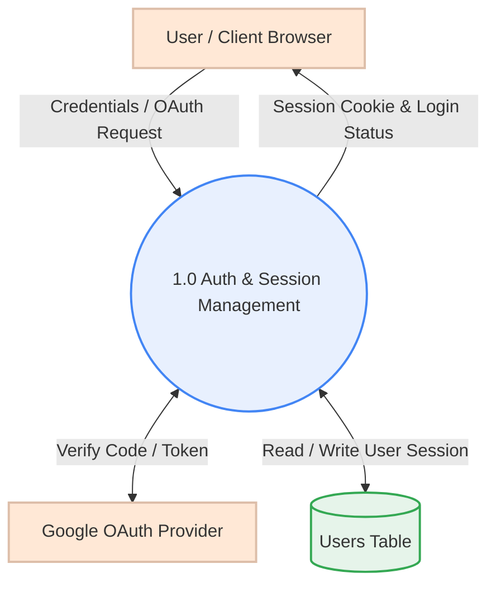
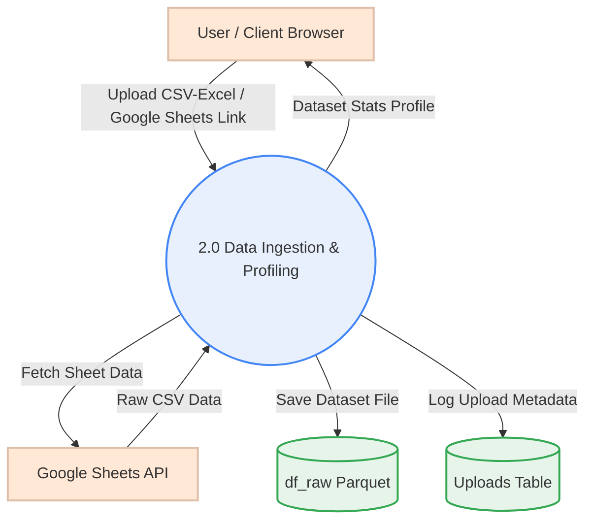
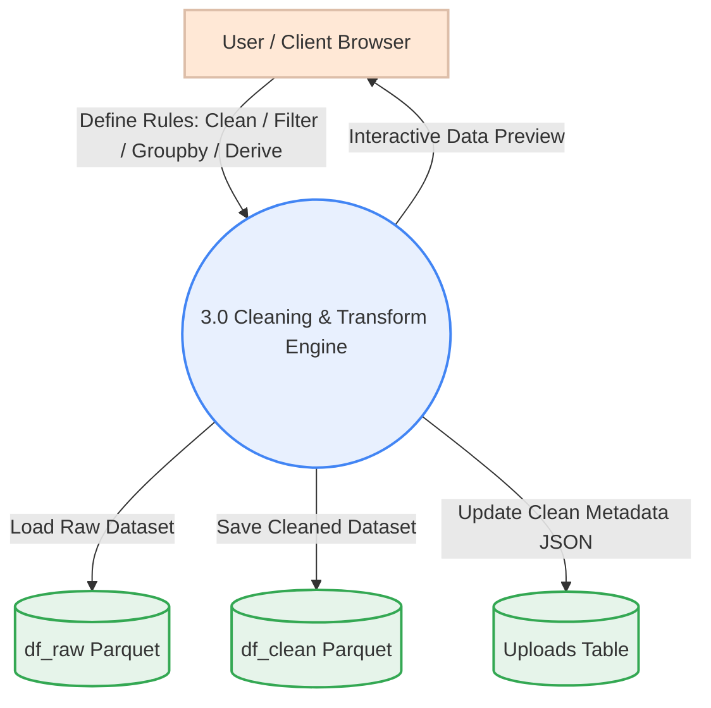
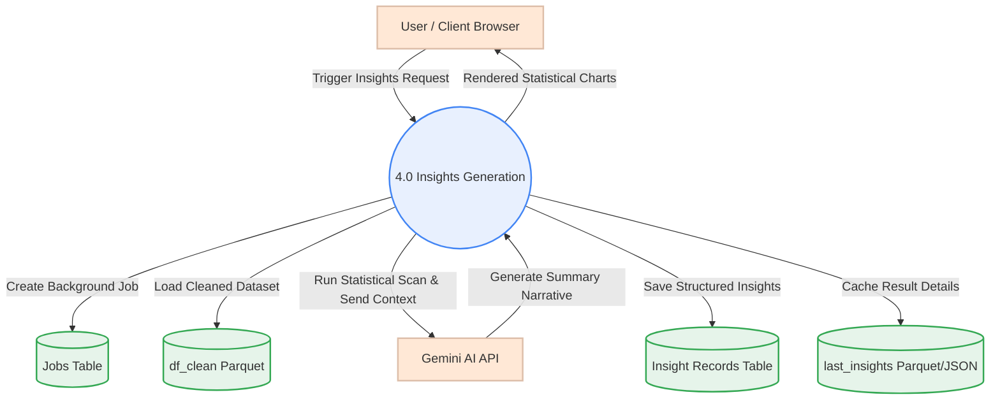
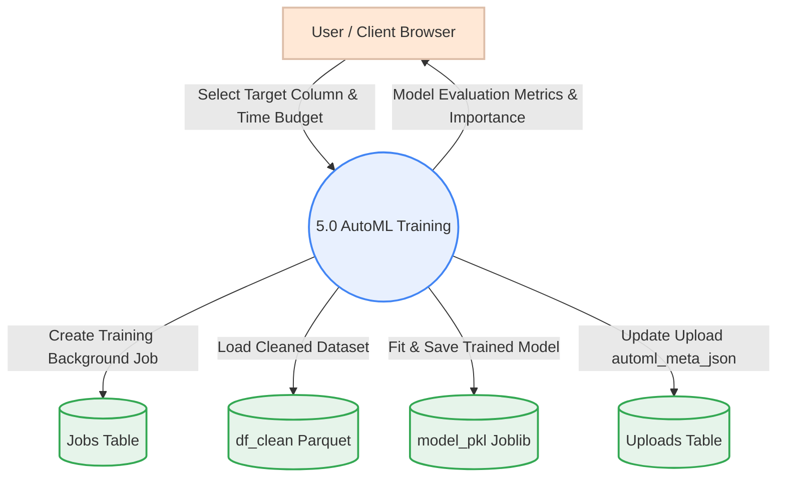
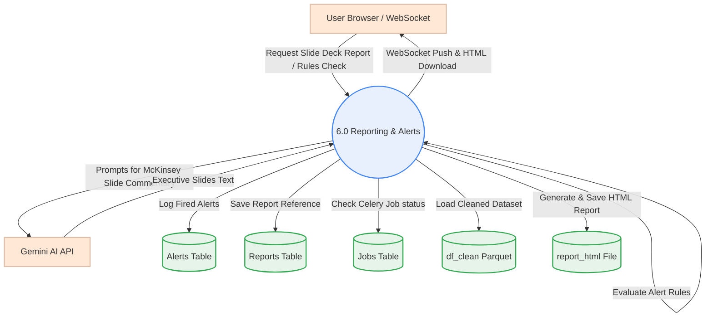

# DataForge v3 — Feature Data Flow Diagrams

This document contains the minimal, portrait-optimized Data Flow Diagrams (DFDs) for each primary feature of the DataForge application, organized individually to fit cleanly in portrait PDF reports.

---

## 🔍 Level 0: Context Level Diagram
Shows system boundaries and data exchange between external entities and the core system.

---

## ⚙️ Level 1: Feature-Specific DFDs

### 1. Authentication & Session Management
Manages user logins, credentials validation, and Google OAuth flow.

---

### 2. Data Ingestion & Import
Handles file uploads (CSV/Excel) and public Google Sheet connections.

---

### 3. Workspace & Transformation Pipeline
Executes dynamic, rule-based data cleaning, filtering, groupings, and derived column calculations.

---

### 4. Insights Engine
Runs plugin scanning rules (Trends, Outliers, Correlations, segment analysis) and calls Gemini to build executive summaries.

---

### 5. AutoML Training
Fits machine learning classifiers or regressors based on target selection, saving and evaluating the results.

---

### 6. Strategic Reporting & Alerting
Generates presentation-ready HTML/PDF reports using McKinsey-formatted slide commentary, evaluates alert conditions, and broadcasts messages via WebSockets.

